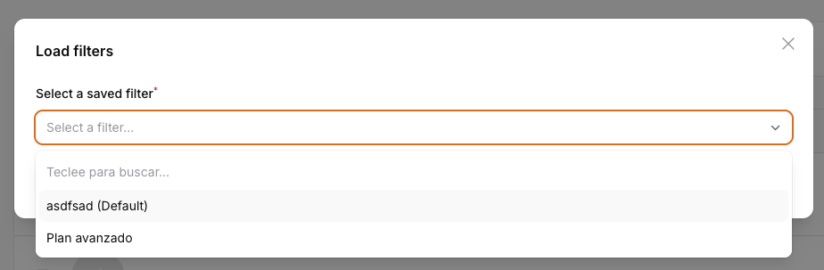

# Filament Filter Presets

[](https://packagist.org/packages/guiu/filament-filter-presets)
[](https://github.com/guiu/filament-filter-presets/actions?query=workflow%3Arun-tests+branch%3Amain)
[](https://github.com/guiu/filament-filter-presets/actions?query=workflow%3A"Fix+PHP+code+style+issues"+branch%3Amain)
[](https://packagist.org/packages/guiu/filament-filter-presets)


This package allows users to save and load predefined filter configurations in Filament resources. It is especially useful when:

- You need quick access to specific combinations of filters that you frequently use
- You want to create predefined filters for different scenarios or use cases
- You wish to set default filters that are automatically applied when a list is loaded
- You want to share filter configurations among different users of the system

With this module, you can:
- Save your custom filters with a name and description
- Quickly load previously saved filters
- Set default filters
- Manage your saved filters (delete, edit, set as default)


### Step by Step

1. 
2. 
3. 

## Prerequisites

Before installing this package, make sure your project meets the following requirements:

- PHP 8.1 or higher
- Laravel 10.0 or higher
- Filament 3.0 or higher

## Installation

1. Install the package via composer:
```bash
composer require guiu/filament-filter-presets
```

2. Publish and run the migrations:
```bash
php artisan vendor:publish --tag=filament-filter-presets-migrations
php artisan migrate
```

3. Optionally, you can publish the translations:
```bash
php artisan vendor:publish --tag=filament-filter-presets-translations
```

## Usage

1. Add the `HasFilterPresets` trait to your List Resource page (not in the main Resource):

```php
namespace App\Filament\Resources\YourResource\Pages;

use Filament\Resources\Pages\ListRecords;
use Guiu\FilamentFilterPresets\Traits\HasFilterPresets;

class ListYourResource extends ListRecords
{
    use HasFilterPresets;

    protected function getHeaderActions(): array
    {
        return [
            Actions\CreateAction::make(),
            ...static::getFilterPresetHeaderActions(),
        ];
    }
}
```

Important:
- The trait must be added to the List class that extends `ListRecords`
- Add the filter preset actions in the `getHeaderActions()` method (NOT in the table configuration)
- Do NOT add the trait to the main Resource class


## Features

- Save filters with name and description
- Mark filters as default
- Load saved filters
- Manage filters (delete, set as default)

## Advanced Customization

### Button Customization

You can customize the appearance of buttons by overriding the following methods:

```php
protected static function getSaveFilterButtonLabel(): string
{
    return 'Save filter';
}

protected static function getLoadFilterButtonLabel(): string
{
    return 'Load filter';
}

protected static function getSaveFilterModalTitle(): string
{
    return 'Save filter configuration';
}

protected static function getLoadFilterModalTitle(): string
{
    return 'Load filter configuration';
}
```

### Integration with Other Plugins

You can integrate this package with other Filament plugins. For example, with the export plugin:

```php
use Filament\Tables\Actions\ExportAction;

public static function table(Table $table): Table
{
    return $table
        ->headerActions([
            ...static::getFilterPresetActions(),
            ExportAction::make()
                ->beforeExporting(function (Builder $query) {
                    // Apply saved filters before exporting
                    if ($preset = static::getDefaultPreset()) {
                        $query = static::applyPresetFilters($query, $preset);
                    }
                    return $query;
                })
        ]);
}
```

### Custom Actions

You can add custom actions to presets:

```php
protected static function getFilterPresetActions(): array
{
    return [
        ...parent::getFilterPresetActions(),
        Action::make('duplicatePreset')
            ->label('Duplicate')
            ->icon('heroicon-o-duplicate')
            ->action(fn (FilterPreset $record) => static::duplicatePreset($record)),
    ];
}
```

## Troubleshooting

### Common Issues

1. **Filters are not saving correctly**
   - Verify that you have run the migrations
   - Check that you have write permissions to the database
   - Make sure filters don't contain too large data

2. **Buttons don't appear**
   - Verify that you have added the `HasFilterPresets` trait
   - Check that you included `...static::getFilterPresetActions()` in table actions
   - Clear Laravel cache: `php artisan cache:clear`

3. **Error loading default filters**
   - Verify that the default filter exists
   - Check that filter fields still exist in the model
   - Clear config cache: `php artisan config:clear`

### Solutions

```bash
# Regenerate composer autoload
composer dump-autoload

# Clear all caches
php artisan optimize:clear

# Verify database integrity
php artisan migrate:status

# If needed, refresh migrations (CAUTION: this will delete data!)
php artisan migrate:fresh
```

## Contributing

If you want to contribute to the development of this package, please:

1. Fork the repository
2. Create a branch for your feature (`git checkout -b feature/amazing-feature`)
3. Commit your changes (`git commit -m 'Add some amazing feature'`)
4. Push to the branch (`git push origin feature/amazing-feature`)
5. Open a Pull Request

## License

This package is licensed under the MIT license.

## Support

If you discover any issues or have questions, please create an issue on GitHub.

---

**Made with ❤️ for the Filament community**

## ☕ Buy me a coffee

If you like this project and it has been useful to you, you can buy me a coffee! ☕

[](https://coff.ee/gerardguiu)

